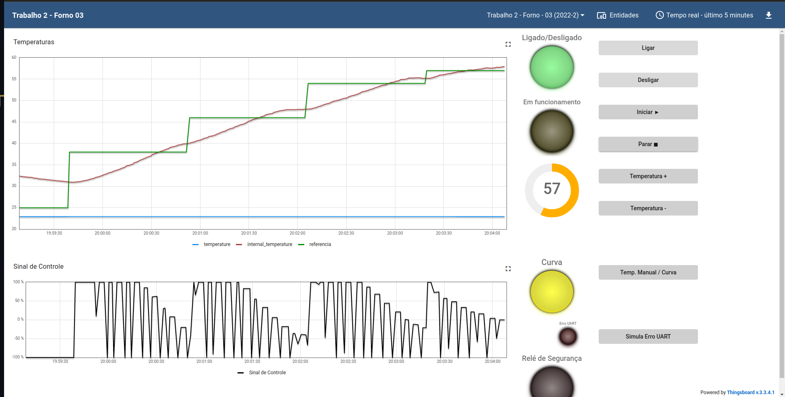
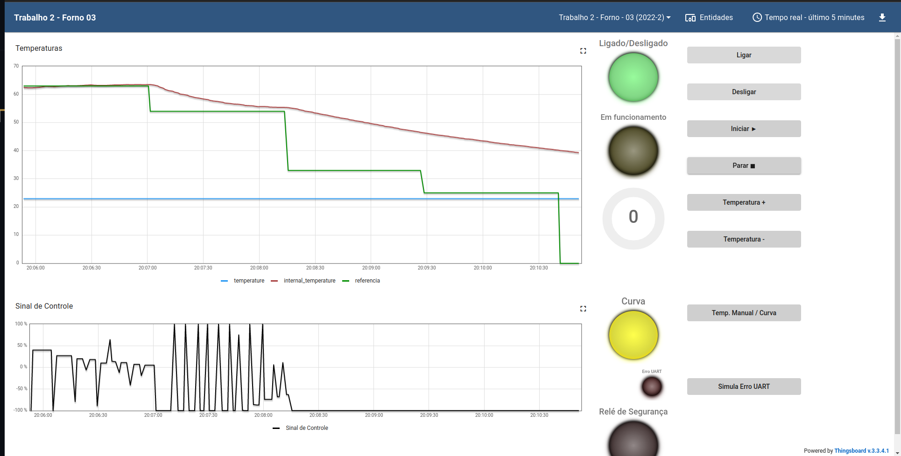

# FSE-2022/2
Trabalho 2 de Fundamentos de Sistemas Embarcados

Aluno   | Matrícula
--------- | ------
João Victor Teixeira Batista | 190109963

## Objetivo 
Este trabalho tem por objetivo a implementação de um sistema (que simula) o controle de um forno para soldagem de placas de circuito impresso (PCBs). Abaixo vemos alguns exemplos de fornos comerciais para este propósito.

## Links importantes
Para acessar o repositório template para o trabalho apresentado, clique [aqui](https://gitlab.com/fse_fga/trabalhos-2022_2/trabalho-2-2022-2). 

## Prints 

## Execução

> Execute na pasta raiz do servidor:
    
    make
> Execute o comando:

    ./bin/bin